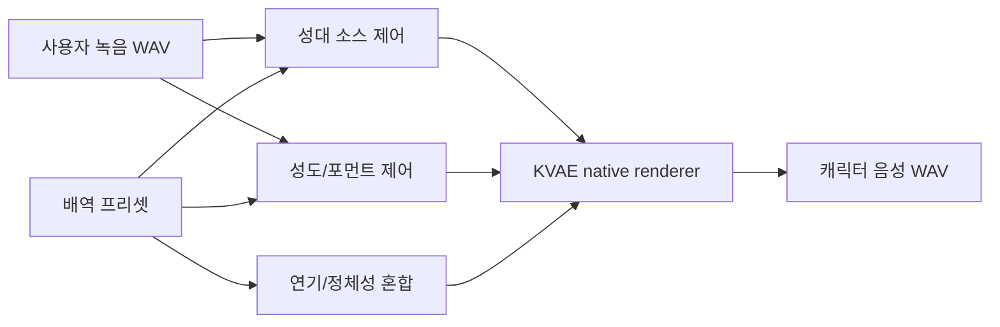

# Korean Voice Acting Engine

[English README](README.md)

KVAE는 한국어에 특화된 로컬 우선 성우 엔진입니다. 사용자가 직접 녹음한 한국어 음성이나 한국어 텍스트를 바탕으로 내레이터, 교사, 악역, 어린이, 늑대, 괴물, 공룡, 드라마 주인공 같은 여러 캐릭터 음성을 만들고 검증하는 것을 목표로 합니다.

장기 목표는 대형 제작사가 성우 연기와 음향효과를 설계하는 방식을 개인 창작자도 무료로 쓸 수 있는 프로그램으로 바꾸는 것입니다. 특정 영화나 게임의 소리를 복제하지 않고, 연기 지시, 음원 출처 관리, 폴리, 동물/합성 레이어, 변형, 믹싱, 검수, 출처 표기, AI 음성 고지를 하나의 안전한 제작 흐름으로 구현합니다.

## 왜 필요한가

대부분의 TTS는 글을 읽어줍니다. KVAE가 하려는 일은 조금 다릅니다.

한국어의 숫자, 날짜, 영어 약어, 조사, 문장 끝, 속도, 호흡, 발음은 매우 섬세합니다. 여기에 사용자의 목소리는 개인 고유재산이므로 공개 저장소와 분리해서 보호해야 합니다. 또한 성우처럼 한 목소리에서 여러 배역을 만들려면 단순한 피치 변경이 아니라 성도 길이, 포먼트, 호흡, 거칠기, 공명, 조음, 감정, 속도, 정체성 혼합을 함께 다뤄야 합니다.

KVAE는 한국어 정규화, 음성 프로필, 배역 설계, 로컬 학습 준비, 음성 변환, 리뷰 리포트를 하나의 엔진으로 묶습니다.

## 현재 기능

- 한국어 숫자, 영어, 기호, 날짜, 시간, 전화번호, 조사 정규화
- `speech_text`, `phoneme_text`, `normalization_trace` 생성
- SSML 및 생성 manifest 출력
- 내레이션, 다큐멘터리, 뉴스, 교사, 이야기꾼, 악역, AI 비서, 어린이, 늑대, 괴물, 공룡 배역 프리셋
- 현대 왕족 남녀 주인공용 오리지널 드라마 배역 프리셋
- `configs/default_voice.local.json` 기반 로컬 기본 목소리 연결
- `kva convert --engine native` 기반 KVAE 자체 음성 변환
- `kva voice-lab --engine native` 기반 다중 배역 후보 생성
- `kva vocal-tract` 기반 성대/성도/source-filter 음성 설계
- 사람 말소리 정체성을 제거하는 bioacoustic 공룡 렌더링
- `kva benchmarks` 기반 전문 성우 프로그램 벤치마크
- `kva source-library` 기반 라이선스 안전 음원 라이브러리 스키마
- `kva creature-design` 기반 크리처 사운드 디자인 레시피
- `kva review-audio` 기반 오디오 품질 검증, 선택적 Whisper ASR, CER/WER
- `kva review-character` 기반 배역 유사도/사람 말소리 흔적 검증
- `kva split-recording`, `kva recording-plan`, `kva transcript-review`, `kva dataset-split` 기반 학습 데이터 준비
- 출처, 라이선스, 표기, AI 음성 고지를 포함한 공개 한국어 AI 음성 카탈로그
- 동의, 프라이버시, 재배포 경계를 담은 안전 manifest

## 빠른 시작

```powershell
git clone https://github.com/sinmb79/korean-voice-acting-engine.git
cd korean-voice-acting-engine
$env:PYTHONPATH = "src"
python -m unittest discover -s tests
```

한국어 문장을 음성용 텍스트로 정규화합니다.

```powershell
python -m kva_engine normalize --file data\sample_input.txt --out outputs\sample.speech.json
```

배역을 적용합니다.

```powershell
python -m kva_engine cast --file data\sample_input.txt --role old_storyteller --out outputs\sample.cast.json
```

녹음 파일을 캐릭터 음성으로 변환합니다. 기본 권장 엔진은 KVAE 자체 엔진인 `native`입니다.

```powershell
python -m kva_engine convert `
  --input my_voice.wav `
  --role monster_deep_clear `
  --engine native `
  --out outputs\monster.wav
```

한 번의 녹음에서 여러 배역 후보를 만듭니다.

```powershell
python -m kva_engine voice-lab `
  --input my_voice.wav `
  --out-dir outputs\voice-lab-demo `
  --group default `
  --engine native `
  --expected-file script.txt `
  --asr-model base
```

전문 제작 방식과 크리처 사운드 설계를 확인합니다.

```powershell
python -m kva_engine benchmarks --compact
python -m kva_engine source-library --compact
python -m kva_engine creature-design --role dinosaur_giant_roar --compact
python -m kva_engine creature-design --role dinosaur_giant_roar --input my_voice.wav --render-out outputs\dinosaur.wav
```

결과 오디오를 검증합니다.

```powershell
python -m kva_engine review-audio `
  --audio outputs\monster.wav `
  --expected-file script.txt `
  --asr-model base `
  --role monster_deep_clear `
  --out outputs\monster.review.json
```

결과가 실제 배역처럼 들리는지도 따로 검증합니다.

```powershell
python -m kva_engine review-character `
  --audio outputs\monster.wav `
  --role monster_deep_clear `
  --out outputs\monster.character-review.json
```

## 엔진 방향

기본 변환 경로인 `kva-native-character-v1`은 ffmpeg나 별도 음성 변환 프로그램을 호출하지 않습니다. WAV 입력을 읽고, KVAE 코드 내부에서 피치, 속도, 포먼트, 스펙트럼 기울기, 호흡, 거칠기, 서브하모닉, 몸통 공명, 원본 정체성 혼합을 직접 계산합니다.



`--engine ffmpeg` 경로는 기존 호환용으로 남겨두었습니다. 앞으로의 개발 중심은 KVAE 자체 렌더러, 한국어 특화 학습 데이터, 역할별 검증 기준, 로컬 GUI입니다.

## Codex 학습 워크플로

KVAE는 보스의 컴퓨터에서 Codex가 로컬 명령을 실행하며 계속 개발하고 정교화하는 방식으로 설계되었습니다.

1. 개인 한국어 음성은 로컬 공유 폴더에 녹음합니다.
2. 개인 음성 프로필은 공개 repo 밖에 보관합니다.
3. Codex가 KVAE 학습, 변환, 렌더, 검증 명령을 실행합니다.
4. 생성된 WAV와 JSON 리포트를 직접 듣고 확인합니다.
5. 한국어 정규화, 배역 프리셋, 음성 이론, 학습 데이터를 개선합니다.
6. GitHub에는 코드, 공개 예제, 문서만 올립니다.

개인 녹음, 데이터셋, LoRA 체크포인트, 학습된 개인 모델 가중치, 개인 식별 가능 생성 WAV는 git에서 제외합니다.

## 문서

- [Codex Training Workflow](docs/CODEX_TRAINING_WORKFLOW.md)
- [Development Roadmap](docs/DEVELOPMENT_ROADMAP.md)
- [KVAE Convert Engine](docs/KVAE_CONVERT_ENGINE.md)
- [Vocal Tract Voice Design](docs/VOCAL_TRACT_ENGINE.md)
- [Voice Lab Workflow](docs/VOICE_LAB_WORKFLOW.md)
- [Character Review Engine](docs/CHARACTER_REVIEW_ENGINE.md)
- [Professional Voice Benchmark Implementation](docs/PRO_VOICE_BENCHMARK_IMPLEMENTATION.md)
- [Creator Sound Design Engine](docs/CREATOR_SOUND_DESIGN_ENGINE.md)
- [Public Korean AI Voice Catalog](docs/PUBLIC_VOICE_CATALOG.md)
- [Native Training Direction](docs/KVA_NATIVE_TRAINING.md)
- [Safety Policy](docs/SAFETY_POLICY.md)
- [Secure Development](docs/SECURE_DEVELOPMENT.md)

## 공개 배포와 개인 음성 보호

KVAE repo는 공개 엔진 저장소이지 개인 음성 데이터셋 저장소가 아닙니다.

공개 repo에 들어가는 것:

- 소스 코드
- 공개 예제
- 문서
- 테스트

공개 repo에 들어가면 안 되는 것:

- 개인 음성 녹음
- 개인 음성 데이터셋
- LoRA 체크포인트
- 학습된 개인 모델 가중치
- 개인 화자를 식별할 수 있는 생성 음성
- `configs/*.local.json` 같은 로컬 설정

목소리는 단순 샘플이 아니라 사람의 정체성입니다. KVAE는 엔진은 공개하고 사람은 보호하는 방향으로 개발합니다.

## 검증

```powershell
$env:PYTHONPATH = "src"
python -m unittest discover -s tests
python -m compileall -q src
python -m kva_engine doctor --voice-profile public:mms-tts-kor
```

## 라이선스

Apache-2.0
