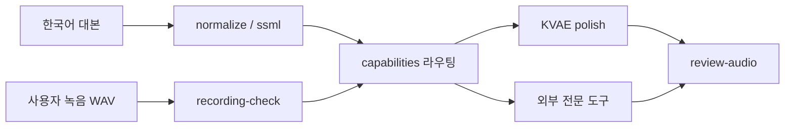

# Korean Voice Acting Engine

[English README](README.md)

KVAE는 한국어에 특화된 로컬 우선 음성 엔진입니다. 현실적인 제품 약속은 사용자가 직접 녹음하거나 생성한 한국어 음성을 더 또렷하게 손질하고, 숏츠/드라마/다큐/공지/교육 같은 실제 사용처에 맞게 세팅하는 것입니다.

KVAE는 더 이상 “한 명의 성인 목소리로 아이, 크리처, 완전히 다른 성우를 기본 기능처럼 만든다”는 약속을 전면에 두지 않습니다. 그 방향은 연구 실험으로 남기고, 현재 쓸 수 있는 핵심은 한국어 음성 정리, 아나운서형 명료도, 사용처별 프리셋입니다.

장기 목표는 대형 제작사가 성우 연기와 음향효과를 설계하는 방식을 개인 창작자도 무료로 쓸 수 있는 프로그램으로 바꾸는 것입니다. 특정 영화나 게임의 소리를 복제하지 않고, 연기 지시, 음원 출처 관리, 폴리, 동물/합성 레이어, 변형, 믹싱, 검수, 출처 표기, AI 음성 고지를 하나의 안전한 제작 흐름으로 구현합니다.

## 왜 필요한가

대부분의 TTS는 글을 읽어줍니다. KVAE가 하려는 일은 조금 다릅니다.

한국어의 숫자, 날짜, 영어 약어, 조사, 문장 끝, 속도, 호흡, 발음은 매우 섬세합니다. 여기에 사용자의 목소리는 개인 고유재산이므로 공개 저장소와 분리해서 보호해야 합니다. 또한 성우처럼 한 목소리에서 여러 배역을 만들려면 단순한 피치 변경이 아니라 성도 길이, 포먼트, 호흡, 거칠기, 공명, 조음, 감정, 속도, 정체성 혼합을 함께 다뤄야 합니다.

KVAE는 한국어 정규화, 음성 프로필, 로컬 학습 준비, 음성 폴리싱, 렌더, 리뷰 리포트를 하나의 엔진으로 묶습니다.

## 현재 제품 기능

- 한국어 숫자, 영어, 기호, 날짜, 시간, 전화번호, 조사 정규화
- `speech_text`, `phoneme_text`, `normalization_trace`, SSML 생성
- `kva polish` 기반 한국어 음성 폴리싱
- cleanup, announcer, shorts, drama, documentary 사용처 프리셋
- `kva review-audio` 기반 오디오 품질 검증, 선택적 Whisper ASR, CER/WER
- `kva split-recording`, `kva recording-plan`, `kva transcript-review`, `kva dataset-split` 기반 학습 데이터 준비
- 출처, 라이선스, 표기, AI 음성 고지를 포함한 공개 한국어 AI 음성 카탈로그
- `configs/default_voice.local.json` 기반 로컬 기본 목소리 연결
- 동의, 프라이버시, 재배포 경계를 담은 안전 manifest
- `kva capabilities` 기반 기능 라우팅
- NVIDIA Nemotron-Personas-Korea를 위한 페르소나 기반 한국어 프롬프트 다양성 라우트
- `kva tts-backends` 기반 TTS/ASR 백엔드 검토 registry
- `kva eval-suite` 기반 한국어 백엔드 평가 문장 suite
- `kva product-quality` 기반 제품 release gate

## 외부 대체 또는 연구 기능

KVAE는 이제 어린이, 늑대, 괴물, 공룡, 완전히 다른 성우 변환을 일반 제품 기능처럼 설명하지 않습니다. 이런 요청은 아래처럼 라우팅합니다.

- 다른 사람 목소리: 동의된 대상 목소리가 있는 외부 speech-to-speech 도구
- 아이/연령 변환 목소리: 라이선스 확인 가능한 한국어 AI 음성 라이브러리 또는 사람 성우
- 크리처/괴물/늑대/공룡: 사운드 디자인 도구, DAW, 폴리, 동물/합성 레이어, 라이선스 안전 소스 라이브러리
- 심한 노이즈/반향 복원: 전문 dialogue repair 도구
- 영상 더빙/자막/최종 조립: 영상/오디오 편집기
- Voice-Pro: 별도 실행하는 GPLv3 WebUI 실험 도구. KVAE에는 코드를 복사하지 않고 산출물만 연동합니다.
- MOSS-TTS-Nano: Apache-2.0 CPU/ONNX 기반의 가벼운 로컬 한국어 TTS fallback 연구 후보
- VibeVoice: MIT 연구 후보. Realtime TTS는 한국어 production 후보가 아니며, ASR은 장문 대본 검수 후보로 봅니다.
- Narrator AI CLI Skill과 Open Generative AI: 영상 내레이션, 시각 생성, 립싱크용 외부 도구이며 KVAE core dependency가 아닙니다.

기존 `kva convert`, `kva voice-lab`, `kva vocal-tract`, `kva creature-design` 명령은 검토 가능한 연구/기획 도구로 남기되, 기본 제품 약속으로 보지 않습니다.

## 빠른 시작

```powershell
git clone https://github.com/sinmb79/korean-voice-acting-engine.git
cd korean-voice-acting-engine
$env:PYTHONPATH = "src"
python -m unittest discover -s tests
```

한국어 문장을 음성용 텍스트로 정규화합니다.

```powershell
python -m kva_engine normalize --file data\sample_input.txt --out outputs\sample.speech.json
```

배역을 적용합니다.

```powershell
python -m kva_engine cast --file data\sample_input.txt --role old_storyteller --out outputs\sample.cast.json
```

요청이 KVAE 내부 기능인지, 외부 전문 프로그램으로 보내야 하는지 먼저 확인합니다.

```powershell
python -m kva_engine capabilities --production-only
python -m kva_engine capabilities --task child_or_age_voice --compact
```

검토된 TTS/ASR 백엔드 후보를 확인합니다.

```powershell
python -m kva_engine tts-backends --production-only
python -m kva_engine tts-backends --id moss_tts_nano --compact
python -m kva_engine tts-backends --id vibevoice_asr --compact
```

한국어 평가 suite를 만들고 후보가 제품 출시 수준인지 확인합니다.

```powershell
python -m kva_engine eval-suite --out-dir outputs\korean-eval-suite
python -m kva_engine product-quality --backend voxcpm2 --use-case shorts --compact
```

한국어 녹음을 실제 사용처에 맞게 손질합니다.

```powershell
python -m kva_engine polish `
  --input my_voice.wav `
  --preset announcer `
  --out outputs\my_voice.announcer.wav `
  --manifest-out outputs\my_voice.announcer.json
```

연구용으로만 한 번의 녹음에서 여러 배역 후보를 만듭니다.

```powershell
python -m kva_engine voice-lab `
  --input my_voice.wav `
  --out-dir outputs\voice-lab-demo `
  --group default `
  --engine native `
  --expected-file script.txt `
  --asr-model base
```

전문 제작 방식과 크리처 사운드 설계를 기획용으로 확인합니다.

```powershell
python -m kva_engine benchmarks --compact
python -m kva_engine source-library --compact
python -m kva_engine creature-design --role dinosaur_giant_roar --compact
```

결과 오디오를 검증합니다.

```powershell
python -m kva_engine review-audio `
  --audio outputs\monster.wav `
  --expected-file script.txt `
  --asr-model base `
  --role monster_deep_clear `
  --out outputs\monster.review.json
```

결과가 실제 배역처럼 들리는지도 따로 검증합니다.

```powershell
python -m kva_engine review-character `
  --audio outputs\monster.wav `
  --role monster_deep_clear `
  --out outputs\monster.character-review.json
```

## 엔진 방향

제품 경로는 한국어 대본 준비, 녹음 검수, 음성 폴리싱입니다. `kva-native-character-v1` 같은 변환 경로는 연구용으로 남기되, 보스가 확인한 것처럼 아이/공룡/괴물 목소리를 제품 기능처럼 약속하지 않습니다.



앞으로의 개발 중심은 한국어 특화 대본 처리, 녹음 품질 진단, 자연스러운 폴리싱, 사용처별 프리셋, 외부 도구와의 안전한 연결입니다.

## Codex 학습 워크플로

KVAE는 보스의 컴퓨터에서 Codex가 로컬 명령을 실행하며 계속 개발하고 정교화하는 방식으로 설계되었습니다.

1. 개인 한국어 음성은 로컬 공유 폴더에 녹음합니다.
2. 개인 음성 프로필은 공개 repo 밖에 보관합니다.
3. Codex가 KVAE 학습, 변환, 렌더, 검증 명령을 실행합니다.
4. 생성된 WAV와 JSON 리포트를 직접 듣고 확인합니다.
5. 한국어 정규화, 배역 프리셋, 음성 이론, 학습 데이터를 개선합니다.
6. GitHub에는 코드, 공개 예제, 문서만 올립니다.

개인 녹음, 데이터셋, LoRA 체크포인트, 학습된 개인 모델 가중치, 개인 식별 가능 생성 WAV는 git에서 제외합니다.

## 문서

- [Codex Training Workflow](docs/CODEX_TRAINING_WORKFLOW.md)
- [Development Roadmap](docs/DEVELOPMENT_ROADMAP.md)
- [Korean Voice Polish Engine](docs/KOREAN_VOICE_POLISH_ENGINE.md)
- [Capability Routing](docs/CAPABILITY_ROUTING.ko.md)
- [External Review: Voice-Pro And Nemotron-Personas-Korea](docs/EXTERNAL_REVIEW_VOICE_PRO_NEMOTRON.ko.md)
- [External Review: Quark SFX, Narrator AI CLI Skill, Open Generative AI](docs/EXTERNAL_REVIEW_QUARK_NARRATOR_OPEN_GENERATIVE.ko.md)
- [External Review: MOSS-TTS-Nano, VoxCPM, VibeVoice](docs/EXTERNAL_REVIEW_TTS_BACKENDS.ko.md)
- [Product Excellence Plan](docs/PRODUCT_EXCELLENCE_PLAN.ko.md)
- [KVAE Convert Engine](docs/KVAE_CONVERT_ENGINE.md)
- [Vocal Tract Voice Design](docs/VOCAL_TRACT_ENGINE.md)
- [Voice Lab Workflow](docs/VOICE_LAB_WORKFLOW.md)
- [Character Review Engine](docs/CHARACTER_REVIEW_ENGINE.md)
- [Professional Voice Benchmark Implementation](docs/PRO_VOICE_BENCHMARK_IMPLEMENTATION.md)
- [Creator Sound Design Engine](docs/CREATOR_SOUND_DESIGN_ENGINE.md)
- [Public Korean AI Voice Catalog](docs/PUBLIC_VOICE_CATALOG.md)
- [Native Training Direction](docs/KVA_NATIVE_TRAINING.md)
- [Safety Policy](docs/SAFETY_POLICY.md)
- [Secure Development](docs/SECURE_DEVELOPMENT.md)

## 공개 배포와 개인 음성 보호

KVAE repo는 공개 엔진 저장소이지 개인 음성 데이터셋 저장소가 아닙니다.

공개 repo에 들어가는 것:

- 소스 코드
- 공개 예제
- 문서
- 테스트

공개 repo에 들어가면 안 되는 것:

- 개인 음성 녹음
- 개인 음성 데이터셋
- LoRA 체크포인트
- 학습된 개인 모델 가중치
- 개인 화자를 식별할 수 있는 생성 음성
- `configs/*.local.json` 같은 로컬 설정

목소리는 단순 샘플이 아니라 사람의 정체성입니다. KVAE는 엔진은 공개하고 사람은 보호하는 방향으로 개발합니다.

## 검증

```powershell
$env:PYTHONPATH = "src"
python -m unittest discover -s tests
python -m compileall -q src
python -m kva_engine doctor --voice-profile public:mms-tts-kor
```

## 라이선스

Apache-2.0
