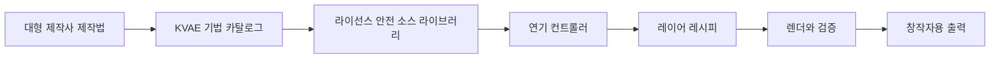

# 크리에이터 사운드 디자인 엔진

[English document](CREATOR_SOUND_DESIGN_ENGINE.md)

KVAE의 크리에이터 사운드 디자인 엔진은 대형 제작사의 성우/음향효과 제작 방식을 개인 창작자가 무료로 쓸 수 있는 로컬 우선 도구로 바꾸기 위한 엔진입니다.

목표는 유명 영화나 게임의 소리를 복사하는 것이 아닙니다. 따라야 할 것은 방식입니다. 연기 의도 설정, 소스 수집, 폴리, 동물/합성 레이어, 변형, 믹싱, 리뷰, 출처, 라이선스, AI 고지까지 하나의 제작 흐름으로 만드는 것입니다.

## 대형 제작사는 어떻게 만드는가

공개 인터뷰와 전문 사운드 디자인 자료를 보면 공통 구조가 있습니다.

- 먼저 관객이 무엇을 느껴야 하는지 정합니다.
- 깨끗한 원천 소리를 직접 녹음하거나 라이선스를 확보합니다.
- 배우의 연기나 가이드 트랙으로 타이밍과 감정 에너지를 잡습니다.
- 동물, 폴리, 합성음, 기계음, 공간음을 레이어로 쌓습니다.
- 피치, 타임스트레치, EQ, 새츄레이션, 리버스, 모핑, 필터, 컨볼루션으로 변형합니다.
- 여러 레이어가 하나의 몸에서 나오는 것처럼 믹싱합니다.
- 여러 후보를 만들고 영상에 붙여 들으며 고릅니다.

크리처 사운드에서는 사람 목소리가 최종 결과 전체가 아닌 경우가 많습니다. 사람 목소리는 연기 컨트롤러가 될 수 있지만, 최종 소리는 동물 녹음, 폴리, 물리적 소품, 합성음, 강한 처리 과정을 거쳐 비인간적으로 만들어집니다.

## 지금 KVAE에 구현된 것

- `kva benchmarks`: 성우 이론, 전문 음성 제품, 생물음향 연구, 대형 제작사식 사운드 디자인 기법을 JSON으로 제공합니다.
- `kva source-library`: 소스 라이브러리 스키마, 라이선스/프라이버시 규칙, 로컬 폴더 스캔, registry 검증을 제공합니다.
- `kva creature-design --role dinosaur_giant_roar`: 인간 말소리 정체성을 제거하는 레이어 레시피를 제공합니다.
- `kva creature-design --role dinosaur_giant_roar --input controller.wav --render-out dinosaur.wav`: 현재 공룡 bioacoustic 경로를 연기 컨트롤러에서 렌더합니다.
- `kva convert`, `kva voice-lab`: 인간 캐릭터 음성 변환 흐름입니다.
- `kva-bioacoustic-dinosaur-v3`: 공룡 배역을 사람 말소리 자체가 아니라 연기의 길이와 에너지 곡선으로만 구동합니다.

## 소스 라이브러리 규칙

모든 소스 레이어에는 다음 정보가 있어야 합니다.

- 소스 ID와 표시 이름
- 소스 유형
- 출처와 제작자/제공자
- 라이선스와 표기 문구
- AI 또는 합성음 여부
- 허용 사용 범위
- 프라이버시 등급
- 태그와 메모

사용하면 안 되는 소스:

- 영화나 게임에서 추출한 소리
- 라이선스가 불명확한 상용 사운드 라이브러리
- 명시적 동의가 없는 실제 사람 목소리
- 공개 저장소에 들어간 개인 음성 녹음

## 공룡과 괴물 소리 방향

공룡 배역에는 약한 사람 말소리 조음 힌트가 남으면 안 됩니다. 녹음된 사람 목소리는 길이, 에너지, 공격감, 릴리즈, 감정 곡선을 제공할 수 있지만, 실제 들리는 소리는 비언어적 몸통 레이어로 구성해야 합니다.

- 연기 에너지 곡선
- 몸통 저역 럼블
- 닫힌 입 기반의 붐/후트
- 목 안쪽 거친 압력
- 작은 스피커에서도 들리는 와이드밴드 공기층
- 공간감과 크기감

늑대와 괴물은 대사가 필요한 clear 변형을 둘 수 있습니다. 하지만 heavy/FX 변형은 사람이 말하는 느낌보다 레이어 기반 크리처 사운드에 가까워져야 합니다.

## 다음 개발 단계

- `kva source-library add` 기반 수동 소스 등록
- 웨이브폼 인덱싱과 소스 태깅
- 늑대, 괴물, 외계 생명체, 폴리 중심 역할까지 확장된 `kva creature-design` 오디오 렌더
- 영상 클립의 액션 스포팅과 폴리 추천
- A/B/C 후보 생성과 사람 청취 점수
- 비교, 원본 바이패스, 출처/라이선스 표시, 내보내기를 갖춘 로컬 UI

## 참고 출처

- Audubon, *Jurassic World*의 새 소리 활용: https://www.audubon.org/magazine/jurassic-worlds-dinosaurs-roar-life-thanks-bird-calls
- Motion Picture Association, *Jurassic World: Fallen Kingdom* 사운드 인터뷰: https://www.motionpictures.org/2018/06/sound-designer-gives-voice-to-the-jurassic-world-fallen-kingdom-dinosaurs/
- Slashfilm, *Jurassic Park* T-Rex 합성 포효: https://www.slashfilm.com/1310511/jurassic-park-got-t-rex-roar-from-combination-of-three-different-animals/
- Sound On Sound, 영상 사운드 디자인: https://www.soundonsound.com/techniques/sound-design-visual-media
- BOOM Library, 동물 소리 녹음: https://www.boomlibrary.com/blog/how-to-record-animal-sound-effects/
- Pro Sound Effects, 크리처 사운드 디자인 튜토리얼: https://blog.prosoundeffects.com/creature-sound-design-tutorial?switchLanguage=ja
- StarWars.com, Skywalker Sound 인터뷰: https://www.starwars.com/news/skeleton-crew-skywalker-sound-interview
- StarWars.com, Ben Burtt 인터뷰: https://www.starwars.com/news/empire-at-40-ben-burtt-interview
- Backstage, *A Quiet Place Part II* 사운드 인터뷰: https://www.backstage.com/magazine/article/a-quiet-place-part-two-sound-editors-interview-73319/
- Space.com, *Project Hail Mary* 외계 언어/음성 디자인: https://www.space.com/entertainment/space-movies-shows/project-hail-mary-sound-designers-used-surprising-animal-sounds-to-create-rockys-musical-alien-voice-interview
- National Center for Voice and Speech: https://ncvs.org/
- SAG-AFTRA AI 자료: https://www.sagaftra.org/contracts-industry-resources/member-resources/artificial-intelligence
