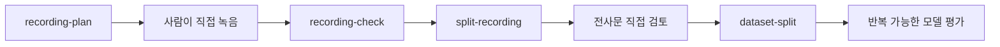

# 데이터셋 준비 워크플로

[English document](DATASET_PREP_WORKFLOW.md)

KVAE에는 이제 한국어 음성 학습 데이터를 로컬에서 준비하는 기본 루프가 들어 있습니다.



## 1. 녹음 대본 만들기

```powershell
$env:PYTHONPATH = "src"
python -m kva_engine recording-plan `
  --out-dir outputs\recording-plan `
  --speaker-id local-speaker `
  --target-minutes 30
```

출력:

- `recording_session_plan.json`
- `recording_script.md`

내장 한국어 prompt bank는 기본 발음, 숫자, 날짜, 시간, 영어 약어, 조사, 문장 끝, 내레이션, 대화, 강의, 뉴스, 어린이, 노인, 악역, 괴물류 연기 문장을 포함합니다.

## 2. 녹음 나누기

```powershell
python -m kva_engine split-recording `
  --audio C:\path\to\session.wav `
  --transcript-file C:\path\to\session.txt `
  --out-dir outputs\segments
```

학습 전에 생성된 WAV 조각과 전사문을 직접 확인해야 합니다. 이 단계에서 NG 테이크, 클리핑, 방 소음, 사적인 내용, 잘못 읽은 문장을 제거합니다.

## 3. 고정 데이터셋 split 만들기

```powershell
python -m kva_engine dataset-split `
  --manifest outputs\segments\segments_manifest.json `
  --out outputs\dataset_split.json `
  --require-transcript
```

KVAE는 세그먼트를 결정적으로 정렬하고 `train`, `validation`, `test` 목록을 split JSON에 저장합니다. 같은 split을 재사용하면 모델 비교가 더 공정해집니다.

## 아직 사람이 해야 하는 일

- 세그먼트를 직접 듣기
- 전사문 교정
- private 내용이나 품질 낮은 take 제거
- neural training에 충분한 데이터인지 판단

현재 도구는 데이터를 준비하고 감사 가능하게 만드는 단계입니다. 사람의 검토를 대체하지는 않습니다.
