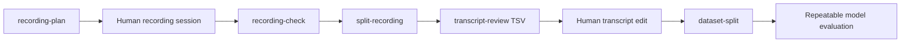

# Dataset Preparation Workflow

[Korean document](DATASET_PREP_WORKFLOW.ko.md)

KVAE now has a local preparation loop for Korean voice training data:



## 1. Create A Recording Script

```powershell
$env:PYTHONPATH = "src"
python -m kva_engine recording-plan `
  --out-dir outputs\recording-plan `
  --speaker-id local-speaker `
  --target-minutes 30
```

This writes:

- `recording_session_plan.json`
- `recording_script.md`

The built-in Korean prompt bank covers clean calibration, numbers, dates, times, English abbreviations, particles, sentence endings, narration, dialogue, teaching, news, child, elder, villain, and creature-style acting.

## 2. Split The Recording

```powershell
python -m kva_engine split-recording `
  --audio C:\path\to\session.wav `
  --transcript-file C:\path\to\session.txt `
  --out-dir outputs\segments
```

Review the produced WAV files and transcript lines before training. This is where bad takes, clipping, room noise, private content, or incorrect transcripts should be removed.

## 3. Review And Apply Transcripts

```powershell
python -m kva_engine transcript-review `
  --manifest outputs\segments\segments_manifest.json `
  --out outputs\segments\transcript_review.tsv
```

Edit the TSV:

- use `corrected_transcript` when a transcript should change
- set `status` to `drop` for bad, noisy, private, or misread segments
- keep notes in the `notes` column

Then apply the review:

```powershell
python -m kva_engine transcript-review `
  --manifest outputs\segments\segments_manifest.json `
  --review-file outputs\segments\transcript_review.tsv `
  --out outputs\segments\reviewed_segments_manifest.json
```

## 4. Create A Stable Dataset Split

```powershell
python -m kva_engine dataset-split `
  --manifest outputs\segments\reviewed_segments_manifest.json `
  --out outputs\dataset_split.json `
  --require-transcript
```

KVAE sorts segments deterministically and writes `train`, `validation`, and `test` lists into the split JSON. Reusing the same split makes model comparisons fairer.

## What Is Still Manual

- listening to the segments
- correcting transcripts
- removing private or low-quality takes
- deciding whether the dataset is large enough for neural training

The current tools prepare and audit the data. They do not replace human review.
