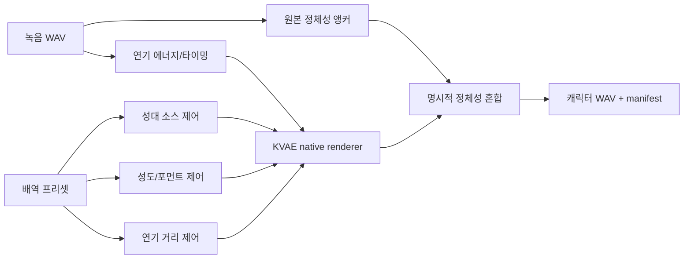

# KVAE Convert Engine

[English document](KVAE_CONVERT_ENGINE.md)

`kva convert`는 사용자가 직접 녹음한 연기 WAV를 KVAE 배역/캐릭터 음성으로 변환합니다.

```powershell
python -m kva_engine convert `
  --input my_acting.wav `
  --role monster_deep `
  --engine native `
  --out outputs\monster.wav
```

## 현재 기본 엔진

현재 기본 구현은 `kva-native-character-v1`입니다.

- WAV 입력을 Python 표준 라이브러리로 직접 읽습니다.
- 피치, 속도, 포먼트, 스펙트럼 기울기, 거칠기, 호흡, 서브하모닉, 몸통 공명, 정체성 혼합을 KVAE 내부에서 계산합니다.
- 외부 음성 변환 프로그램에 맡기지 않고, 원본 녹음의 타이밍과 에너지를 캐릭터 렌더러의 입력으로 사용합니다.
- native peak normalization을 적용합니다.
- WAV와 manifest를 함께 씁니다.

기존 `kva-convert-ffmpeg-v1` 경로는 `--engine ffmpeg`로 남겨두었습니다. 호환성이나 비-WAV 준비가 필요할 때만 사용하고, 제품 개발의 중심은 native 엔진입니다.

## Native Renderer 구조



공룡 같은 비인간 배역은 `kva-native-character-v1`에서 KVAE bioacoustic 렌더러로 연결됩니다. 사람 말소리 정체성은 audible signal에서 제거하고, 원본 녹음은 길이와 에너지 곡선만 제공합니다.

## 예시

```powershell
python -m kva_engine convert --input voice.wav --role wolf_growl --out wolf.wav
python -m kva_engine convert --input voice.wav --role wolf_growl_clear --out wolf-clear.wav
python -m kva_engine convert --input voice.wav --role wolf_growl_heavy --out wolf-heavy.wav
python -m kva_engine convert --input voice.wav --role monster_deep --out monster.wav
python -m kva_engine convert --input voice.wav --role monster_deep_clear --out monster-clear.wav
python -m kva_engine convert --input voice.wav --role monster_deep_fx --out monster-fx.wav
python -m kva_engine convert --input voice.wav --role dinosaur_giant --out dinosaur.wav
python -m kva_engine convert --input voice.wav --role dinosaur_giant_clear --out dinosaur-clear.wav
python -m kva_engine convert --input voice.wav --role dinosaur_giant_roar --out dinosaur-roar.wav
python -m kva_engine convert --input voice.wav --role child_bright --out child.wav
python -m kva_engine convert --input voice.wav --role twentyfirst_prince_lead --out prince.wav
python -m kva_engine convert --input voice.wav --role twentyfirst_grand_lady_lead --out lady.wav
```

## 변환 후 검증

결과는 `review-audio`로 바로 검수합니다.

```powershell
python -m kva_engine review-audio `
  --audio wolf.wav `
  --expected-file script.txt `
  --asr-model base `
  --role wolf_growl `
  --out wolf.review.json
```

`monster_deep_fx`, `dinosaur_giant_roar`처럼 강한 효과가 들어간 배역은 캐릭터성은 강하지만 명료도가 낮아질 수 있습니다. 대사형 결과물은 먼저 `*_clear` 배역을 기준으로 만들고, heavy/fx/roar 계열은 연출용 후보로 비교하는 것이 좋습니다.
