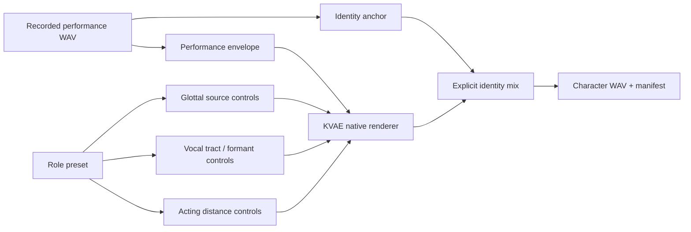

# KVAE Convert Engine

[한국어 문서](KVAE_CONVERT_ENGINE.ko.md)

`kva convert` takes a recorded voice performance as input and turns it into a KVAE role or character voice.

```powershell
python -m kva_engine convert `
  --input my_acting.wav `
  --role monster_deep `
  --engine native `
  --out outputs\monster.wav
```

## Current Engine

The default implementation is `kva-native-character-v1`.

- It reads WAV input directly in Python.
- It renders a KVAE-owned source-filter character branch: pitch, tempo, formants, spectral tilt, roughness, breath, subharmonics, body resonance, and identity mixing.
- It uses the source recording as performance timing and energy, not as an external program dependency.
- It applies native peak normalization.
- It writes a WAV file and a manifest.

This is the deterministic local conversion layer. It gives users an immediate offline character-voice workflow while KVAE keeps the same CLI contract for future neural speech-to-speech backends.

The old `kva-convert-ffmpeg-v1` path remains available with `--engine ffmpeg` for compatibility and non-WAV preparation. The product direction is the native engine.

## Native Renderer Contract



For nonhuman dinosaur roles, `kva-native-character-v1` routes to KVAE's bioacoustic renderer. The audible source-speaker identity is removed; only timing and energy drive the synthesized low boom, body rumble, throat grit, and pressure noise.

## Future Neural Backends

The same command contract can later be backed by:

- RVC-style voice conversion
- FreeVC-style speech-to-speech conversion
- so-vits-svc-style singing/speech conversion
- KVAE's own Korean speech-to-speech model

## Examples

```powershell
python -m kva_engine convert --input voice.wav --role wolf_growl --out wolf.wav
python -m kva_engine convert --input voice.wav --role wolf_growl_clear --out wolf-clear.wav
python -m kva_engine convert --input voice.wav --role wolf_growl_heavy --out wolf-heavy.wav
python -m kva_engine convert --input voice.wav --role monster_deep --out monster.wav
python -m kva_engine convert --input voice.wav --role monster_deep_clear --out monster-clear.wav
python -m kva_engine convert --input voice.wav --role monster_deep_fx --out monster-fx.wav
python -m kva_engine convert --input voice.wav --role dinosaur_giant --out dinosaur.wav
python -m kva_engine convert --input voice.wav --role dinosaur_giant_clear --out dinosaur-clear.wav
python -m kva_engine convert --input voice.wav --role dinosaur_giant_roar --out dinosaur-roar.wav
python -m kva_engine convert --input voice.wav --role child_bright --out child.wav
python -m kva_engine convert --input voice.wav --role monster_deep_fx --engine ffmpeg --out legacy-monster.wav
```

## Review After Conversion

Run `review-audio` after conversion:

```powershell
python -m kva_engine review-audio `
  --audio wolf.wav `
  --expected-file script.txt `
  --asr-model base `
  --role wolf_growl `
  --out wolf.review.json
```

Strong character effects such as `monster_deep_fx` and `dinosaur_giant_roar` may reduce intelligibility. For dialogue, prefer `*_clear` roles first and keep heavy/fx/roar roles as performance options.
