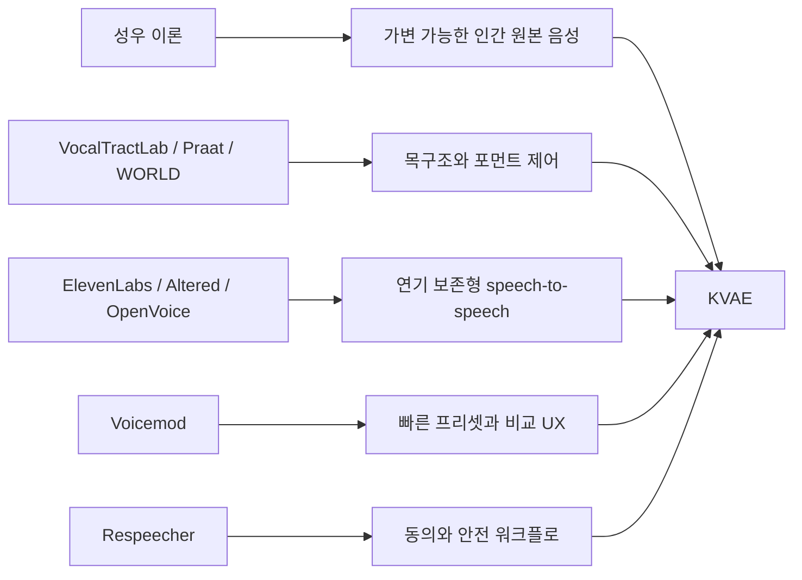

# 전문 성우 프로그램 벤치마킹 반영

[English document](PRO_VOICE_BENCHMARK_IMPLEMENTATION.md)

KVAE는 기존 음성 도구를 벤치마킹하지만, 목표는 한 제품을 복제하는 것이 아닙니다. 쓸 만한 장점을 모아 한국어 특화 성우 엔진으로 합치는 것이 목표입니다.



## 프로그램 명령

```powershell
$env:PYTHONPATH = "src"
python -m kva_engine benchmarks --compact
```

이 명령은 어떤 제품에서 무엇을 배웠고, KVAE에 무엇을 반영했으며, 무엇이 아직 남았는지 JSON으로 보여줍니다.

## 반영한 장점

- VocalTractLab: 목구조와 조음 제어를 명시적으로 모델링
- Praat: 목소리를 source와 filter로 나누고 포먼트를 조작
- WORLD: F0, spectral envelope, aperiodicity 기반 future backend 확보
- ElevenLabs Voice Changer: 원본 연기의 감정, 타이밍, 전달력 보존
- Altered Studio: 녹음/불러오기, 목표 음성 선택, 컨트롤 조정, 샘플 생성 흐름
- Voicemod: 원클릭 프리셋, 슬라이더, bypass/original 비교 UX
- OpenVoice: 음색과 style control, 즉 감정, 억양, 쉼, 리듬 분리
- Respeecher: 동의, 고지, 안전 메타데이터를 워크플로 안에 포함

## KVAE의 해석

중요한 명제는 이것입니다. 인간의 음성은 본래 성우적으로 가변 가능합니다. 성우라는 직업은 한 사람이 공명, 성대 원음, 조음, 속도, 쉼, 감정을 바꿔 여러 정체성처럼 들리게 만들 수 있다는 증명입니다.

KVAE는 이를 아래 구조로 모델링합니다.

- source variation: pitch, breath, roughness, pressure
- filter variation: 성도 길이, 포먼트, 비강/구강 공명
- articulation variation: 턱, 혀, 자음 명료도, 모음 안정성
- performance variation: 속도, 쉼, 감정, 문장 끝 처리
- identity anchoring: 원본 화자의 정체성을 얼마나 남길지

## 현재 구현

- `kva vocal-tract`: source-filter 목구조 설계
- `kva convert`: 벤치마킹 정렬 메타데이터와 강화된 역할 변환
- `kva voice-lab`: 여러 역할 후보, playlist, manifest, review 파일
- `kva review-audio`: 객관 품질 게이트
- `kva benchmarks`: 제품 벤치마킹 리포트

## 다이노사우르스 목소리 수정

이전 다이노사우르스 샘플은 거대한 생물이라기보다 낮게 변조된 사람 목소리에 가까웠습니다. 그래서 v2에서는 단일 피치 변환이 아니라 레이어 구조를 사용합니다.

- main transformed voice
- 매우 낮은 흉강 공명 레이어
- 거친 목 울림/grit 레이어
- 지연된 저역 body rumble 레이어
- 원본 연기 타이밍이 느려진 사람 목소리처럼 무너지지 않도록 길이 보존 pitch 레이어

아직 최종 neural backend는 아니지만, WORLD/neural renderer를 붙이기 전 제품형 v2 효과로는 훨씬 더 방향이 맞습니다.
