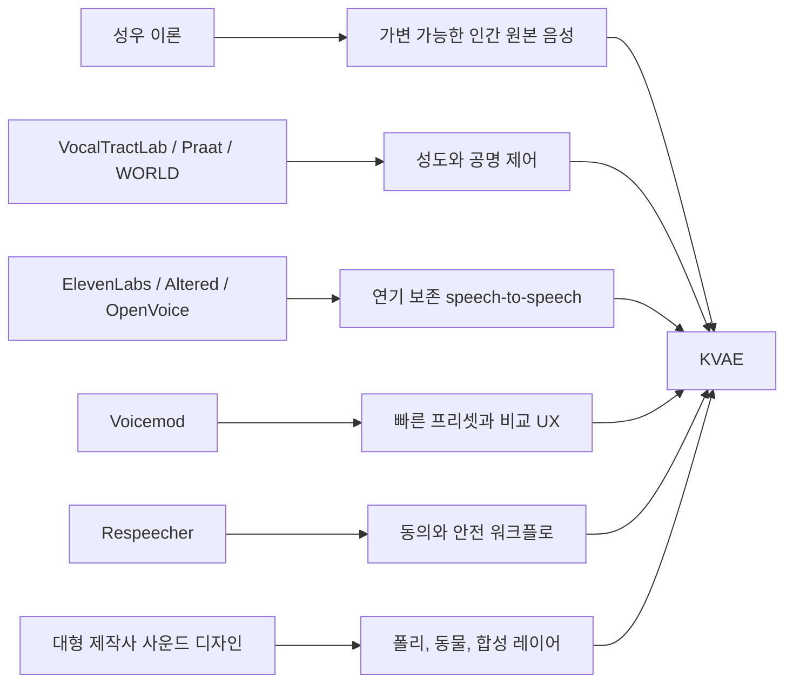

# 전문 성우/음성 프로그램 벤치마크 반영

[English document](PRO_VOICE_BENCHMARK_IMPLEMENTATION.md)

KVAE는 기존 음성 도구를 벤치마킹하지만, 목표는 특정 제품을 복제하는 것이 아닙니다. 쓸 만한 장점을 모아 한국어 특화 성우 엔진으로 합치는 것이 목표입니다.



## 프로그램 명령

```powershell
$env:PYTHONPATH = "src"
python -m kva_engine benchmarks --compact
```

이 명령은 어떤 제품과 제작법에서 무엇을 배웠고, KVAE에 무엇이 반영되었으며, 무엇이 아직 남아 있는지 JSON으로 보여줍니다.

## 반영한 장점

- VocalTractLab: 목구조와 조음 제어를 명시적으로 모델링합니다.
- Praat: 목소리를 source와 filter로 나누고 formant를 조작합니다.
- WORLD: F0, spectral envelope, aperiodicity 기반 분석/합성 backend를 준비합니다.
- ElevenLabs Voice Changer: 배우 녹음의 감정, 타이밍, 전달력을 보존합니다.
- Altered Studio: 녹음/불러오기, 목표 음성 선택, 컨트롤 조정, 샘플 생성 흐름을 참고합니다.
- Voicemod: 원클릭 프리셋, 커스터마이징 슬라이더, 원본/변환 비교 UX를 참고합니다.
- OpenVoice: 음색과 rhythm, pause, emotion, intonation 같은 style control을 분리합니다.
- Respeecher: 동의, 고지, 안전 메타데이터를 워크플로 안에 포함합니다.
- 대형 제작사 크리처 제작법: 사람 목소리를 단순히 낮추는 것이 아니라 연기 의도, 소스 녹음, 폴리, 동물, 합성음, 변형, 믹스, 리뷰를 조합합니다.

## KVAE의 해석

핵심 명제는 이것입니다. 인간의 목소리는 본래 성우적으로 가변 가능합니다. 성우라는 직업은 한 사람이 공명, 성대 소스, 조음, 속도, 쉼, 감정을 바꿔 여러 정체성처럼 들리게 만들 수 있다는 증거입니다.

KVAE는 이를 다음 구조로 모델링합니다.

- source variation: pitch, breath, roughness, pressure
- filter variation: 성도 길이, formant, 비강/구강 공명
- articulation variation: 턱, 혀, 자음 명료도, 모음 안정성
- performance variation: 속도, 쉼, 감정, 문장 끝 처리
- identity anchoring: 원본 화자의 정체성을 얼마나 남길지

## 현재 구현

- `kva vocal-tract`: source-filter 목구조 설계
- `kva convert`: 벤치마크 정렬 메타데이터와 역할 변환
- `kva voice-lab`: 여러 역할 후보, playlist, manifest, review 파일
- `kva review-audio`: 객관적 품질 게이트
- `kva benchmarks`: 제품/제작법 벤치마크 리포트
- `kva source-library`: 출처, 라이선스, 프라이버시, AI/합성음 고지 스키마
- `kva creature-design`: 스튜디오식 크리처 레이어 레시피

## 대형 제작사식 사운드 디자인 벤치마크

KVAE는 이제 사운드 디자인을 단순 참고자료가 아니라 프로그램 요구사항으로 취급합니다.

벤치마크에서 뽑은 원칙:

- 크리처 목소리는 한 사람 목소리를 낮춘 것이 아니라 여러 소스의 합성인 경우가 많습니다.
- 동물 녹음은 살아 있는 느낌과 감정 단서를 제공합니다.
- 폴리는 몸, 움직임, 접촉, 무게, 질감을 줍니다.
- 합성 공명기와 노이즈 레이어는 안전하게 불가능한 해부학을 만듭니다.
- 변형 체인은 명시적이고 반복 가능해야 합니다.
- 모든 소스 레이어에는 출처, 라이선스, 표기, AI/합성 여부가 있어야 합니다.
- 최종 품질은 후보 비교와 사람 청취 리뷰가 필요합니다.

현재 확인 명령:

```powershell
python -m kva_engine source-library --compact
python -m kva_engine creature-design --role dinosaur_giant_roar --compact
```

공룡 레시피는 `source_speech_audible=false`, `source_voice_identity_retained=false`를 명시합니다. 즉, 사람 말소리 조음 힌트가 남지 않아야 합니다.

## 공룡 목소리 수정 방향

초기 공룡 샘플은 거대한 비인간 동물보다는 낮게 변조된 사람 목소리에 가까웠습니다. 그래서 KVAE는 공룡 역할을 voice identity conversion이 아니라 bioacoustic synthesis로 처리합니다.

- 원본 화자의 정체성은 오디오 신호에서 제거합니다.
- 원본 녹음은 길이, 에너지 곡선, 강약 변화 제어에만 사용합니다.
- 실제 출력은 closed-mouth boom/hoot carrier, body rumble, throat grit, pressure noise로 합성합니다.
- 이전 layered pitch chain은 fallback/debug 경로로만 남깁니다.

연구 기준:

- Riede et al., "Coos, Booms, and Hoots": https://academic.oup.com/evolut/article-abstract/70/8/1734/6851892
- UT Jackson School 요약: https://www.jsg.utexas.edu/news/2016/07/bird-research-suggests-calling-dinosaurs-may-have-been-tight-lipped
