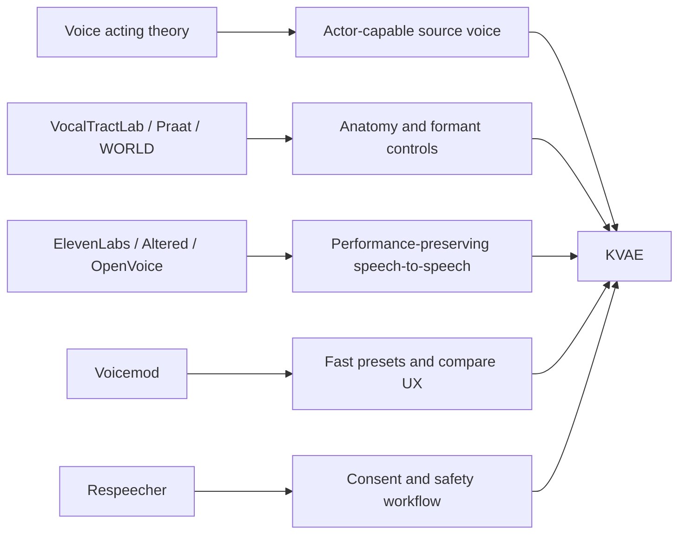

# Professional Voice Benchmark Implementation

[Korean document](PRO_VOICE_BENCHMARK_IMPLEMENTATION.ko.md)

KVAE benchmarks existing voice tools, but the goal is not to copy one product. The goal is to combine the useful parts into a Korean-first voice acting engine.



## Program Command

```powershell
$env:PYTHONPATH = "src"
python -m kva_engine benchmarks --compact
```

The command returns the product lessons, what KVAE already adopted, and what remains.

## Adopted Lessons

- VocalTractLab: make vocal-tract anatomy and articulation explicit.
- Praat: split voice into source and filter, then manipulate formants.
- WORLD: reserve a future analysis/synthesis backend for F0, spectral envelope, and aperiodicity.
- ElevenLabs Voice Changer: preserve emotion, timing, and delivery from the actor's recording.
- Altered Studio: record/import, choose target voice/model, tune controls, generate a sample.
- Voicemod: one-click presets, customization sliders, bypass/compare UX.
- OpenVoice: separate tone color from style controls such as rhythm, pauses, emotion, and intonation.
- Respeecher: make consent, disclosure, and safety metadata part of the workflow.

## KVAE Interpretation

The important claim is that a human voice is actor-capable. A voice actor proves that one speaker can produce many perceived identities by changing resonance, source quality, articulation, timing, and emotion.

KVAE models that as:

- source variation: pitch, breath, roughness, pressure
- filter variation: vocal tract length, formants, nasal/oral resonance
- articulation variation: jaw, tongue, consonant precision, vowel stability
- performance variation: tempo, pause, emotion, ending style
- identity anchoring: how much of the source speaker should remain

## Current Implementation

- `kva vocal-tract`: source-filter vocal tract design
- `kva convert`: benchmark alignment metadata and stronger role transforms
- `kva voice-lab`: multiple role candidates, playlist, manifests, review files
- `kva review-audio`: objective quality gates
- `kva benchmarks`: product benchmark report

## Dinosaur Voice Fix

The first dinosaur sample sounded like a low-pitched voice, not a large creature. KVAE now uses a layered dinosaur chain:

- main transformed voice
- very low chest-resonance layer
- rough throat/grit layer
- delayed low-frequency body rumble
- duration-preserving pitch layers so the actor's timing does not collapse into a slow human voice

This is still not the final neural backend, but it is a better product-facing v2 effect while the WORLD/neural renderer is being developed.
