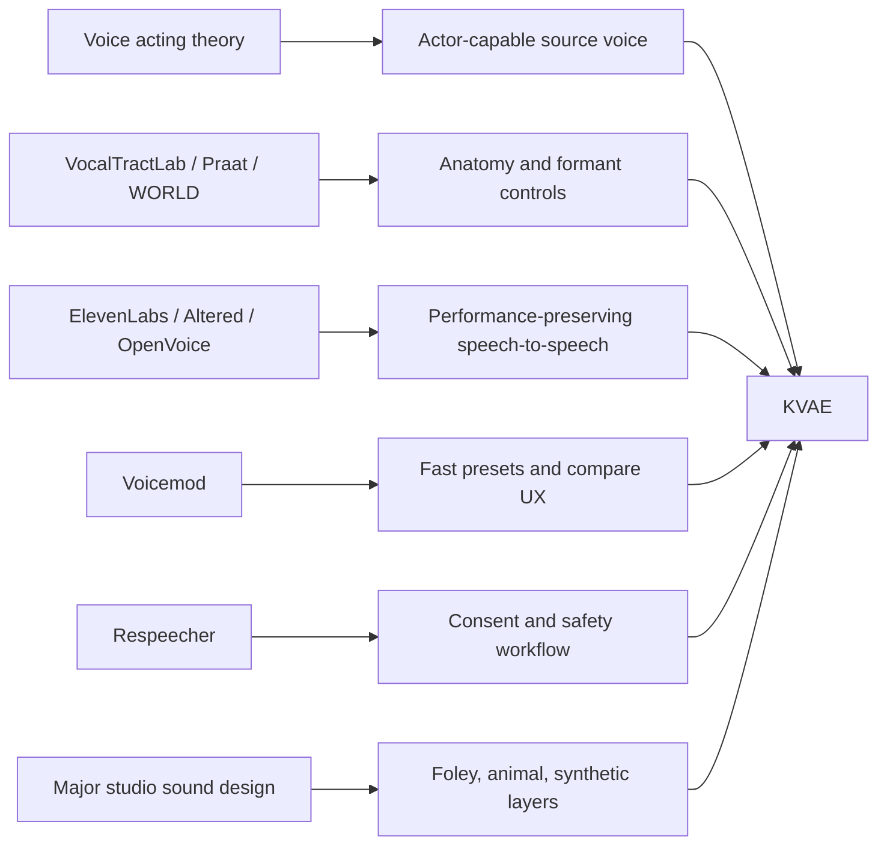

# Professional Voice Benchmark Implementation

[Korean document](PRO_VOICE_BENCHMARK_IMPLEMENTATION.ko.md)

KVAE benchmarks existing voice tools, but the goal is not to copy one product. The goal is to combine the useful parts into a Korean-first voice acting engine.



## Program Command

```powershell
$env:PYTHONPATH = "src"
python -m kva_engine benchmarks --compact
```

The command returns the product lessons, what KVAE already adopted, and what remains.

## Adopted Lessons

- VocalTractLab: make vocal-tract anatomy and articulation explicit.
- Praat: split voice into source and filter, then manipulate formants.
- WORLD: reserve a future analysis/synthesis backend for F0, spectral envelope, and aperiodicity.
- ElevenLabs Voice Changer: preserve emotion, timing, and delivery from the actor's recording.
- Altered Studio: record/import, choose target voice/model, tune controls, generate a sample.
- Voicemod: one-click presets, customization sliders, bypass/compare UX.
- OpenVoice: separate tone color from style controls such as rhythm, pauses, emotion, and intonation.
- Respeecher: make consent, disclosure, and safety metadata part of the workflow.
- Major studio creature workflows: use acting intent, source recording, Foley, animal, synthetic, transformation, mix, and review instead of only lowering a human voice.

## KVAE Interpretation

The important claim is that a human voice is actor-capable. A voice actor proves that one speaker can produce many perceived identities by changing resonance, source quality, articulation, timing, and emotion.

KVAE models that as:

- source variation: pitch, breath, roughness, pressure
- filter variation: vocal tract length, formants, nasal/oral resonance
- articulation variation: jaw, tongue, consonant precision, vowel stability
- performance variation: tempo, pause, emotion, ending style
- identity anchoring: how much of the source speaker should remain

## Current Implementation

- `kva vocal-tract`: source-filter vocal tract design
- `kva convert`: benchmark alignment metadata and stronger role transforms
- `kva voice-lab`: multiple role candidates, playlist, manifests, review files
- `kva review-audio`: objective quality gates
- `kva benchmarks`: product benchmark report
- `kva source-library`: source provenance, license, privacy, AI/synthetic disclosure schema, local scan, and validation
- `kva creature-design`: studio-style creature layer recipe and current dinosaur bioacoustic render entrypoint

## Major Studio Sound Design Benchmark

KVAE now treats studio sound design as a program requirement, not only a research note.

Benchmarked lessons:

- creature voices are often composites, not one human voice lowered in pitch
- animal recordings can provide believable living cues
- Foley gives body, movement, contact, weight, and texture
- synthetic resonators and noise layers can create impossible anatomy safely
- transformation chains should be explicit and repeatable
- every source layer needs provenance, license, attribution, and AI/synthetic disclosure
- final quality requires candidate comparison and human listening review

Current implementation:

```powershell
python -m kva_engine source-library --compact
python -m kva_engine source-library --scan-dir sources\creature --out outputs\source-library.scan.json
python -m kva_engine creature-design --role dinosaur_giant_roar --compact
python -m kva_engine creature-design --role dinosaur_giant_roar --input controller.wav --render-out outputs\dinosaur.wav
```

The dinosaur recipe explicitly requires `source_speech_audible=false` and `source_voice_identity_retained=false`.

## Dinosaur Voice Fix

The first dinosaur samples sounded like low-pitched human voices, not a large nonhuman animal. KVAE now treats dinosaur roles as bioacoustic synthesis, not voice identity conversion.

- the source speaker identity is removed from the audible signal
- the source recording is used only for duration, energy envelope, and performance dynamics
- the rendered sound uses closed-mouth boom/hoot carriers, sub-bass body rumble, throat grit, and pressure noise
- the older layered pitch chain remains only as a fallback/debug path

This follows the research direction that some dinosaurs may have used low-frequency closed-mouth vocalization rather than mammal-like open-mouth roars.

Research anchors:

- Riede et al., "Coos, Booms, and Hoots": https://academic.oup.com/evolut/article-abstract/70/8/1734/6851892
- UT Jackson School summary: https://www.jsg.utexas.edu/news/2016/07/bird-research-suggests-calling-dinosaurs-may-have-been-tight-lipped
