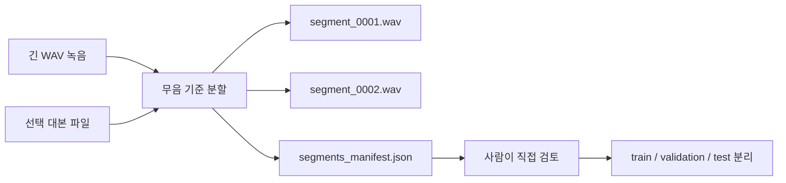

# 녹음 세그먼트 분할 워크플로

[English document](RECORDING_SEGMENTATION.md)

`kva split-recording`은 긴 한국어 녹음 세션을 학습 검토용 WAV 조각으로 나누는 명령입니다.

이 기능은 최종 신경망 학습기가 아니라, 좋은 학습 데이터를 만들기 위한 준비 도구입니다. 각 조각에는 원본 시간대, 대본 줄, 오디오 품질 분석, 출처 manifest가 함께 남습니다.



## 기본 명령

```powershell
$env:PYTHONPATH = "src"
python -m kva_engine split-recording `
  --audio C:\path\to\session.wav `
  --transcript-file C:\path\to\transcript.txt `
  --out-dir outputs\segments `
  --compact
```

대본 파일은 선택 사항입니다. 대본을 넣으면 비어 있지 않은 줄을 감지된 세그먼트에 순서대로 연결합니다.

## 출력물

- `segment_0001.wav`, `segment_0002.wav` 같은 분할 WAV 파일
- `segments_manifest.json`
- 각 조각의 길이, 원본 시간대, 대본 줄, SHA-256, RMS, peak, silence ratio 등 WAV 분석 정보
- 대본 줄 수와 감지된 세그먼트 수가 맞지 않을 때 경고

## 조정 옵션

- `--silence-threshold`: 조용한 말이 빠지면 낮추고, 방 소음이 말로 잡히면 올립니다.
- `--min-silence-ms`: 문장이 너무 잘게 쪼개지면 값을 키웁니다.
- `--min-segment-ms`: 짧은 잡음이나 숨소리를 버리고 싶으면 값을 키웁니다.
- `--padding-ms`: 말 앞뒤의 아주 짧은 여유를 남깁니다.

## 검토 순서

1. 깨끗한 한국어 음성을 로컬에서 녹음합니다.
2. 전체 파일에 `kva recording-check`를 실행합니다.
3. `kva split-recording`으로 조각을 만듭니다.
4. 각 조각을 직접 들어봅니다.
5. 학습 전에 대본을 교정합니다.
6. 클리핑, 잡음, 오독, 사적인 내용이 들어간 조각은 제거합니다.
7. 그 다음 train/validation/test 세트로 나눕니다.

개인 음성 조각은 공개 저장소 밖에 둬야 합니다. 공개할 수 있는 것은 엔진이고, 보호해야 하는 것은 사람의 목소리입니다.
