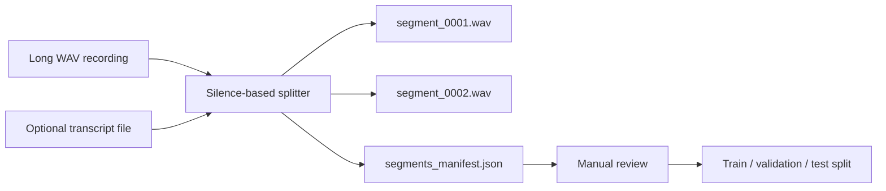

# Recording Segmentation Workflow

[Korean document](RECORDING_SEGMENTATION.ko.md)

`kva split-recording` turns a long Korean recording session into smaller WAV segments that can later be reviewed, corrected, and used for training.

This is a preparation tool, not a final neural trainer. Its job is to create auditable data: every segment keeps its timestamp, transcript line, audio quality analysis, and source manifest.



## Basic Command

```powershell
$env:PYTHONPATH = "src"
python -m kva_engine split-recording `
  --audio C:\path\to\session.wav `
  --transcript-file C:\path\to\transcript.txt `
  --out-dir outputs\segments `
  --compact
```

The transcript file is optional. When supplied, KVAE matches non-empty transcript lines to detected segments in order.

## Outputs

- `segment_0001.wav`, `segment_0002.wav`, and later segment files
- `segments_manifest.json`
- per-segment duration, source timestamp, transcript line, SHA-256, RMS, peak, silence ratio, and other WAV analysis fields
- warnings when transcript line count does not match detected segments

## Useful Thresholds

- `--silence-threshold`: lower it when quiet speech is missed; raise it when room noise becomes speech.
- `--min-silence-ms`: increase it when sentences are being split too aggressively.
- `--min-segment-ms`: increase it to discard short noises or breaths.
- `--padding-ms`: keep a small margin before and after each utterance.

## Review Loop

1. Record clean Korean voice data locally.
2. Run `kva recording-check` on the full file.
3. Run `kva split-recording`.
4. Listen to each segment.
5. Correct transcripts before training.
6. Remove clipped, noisy, misread, or private segments.
7. Only then create train/validation/test splits.

Private voice segments must stay outside the public repository. The engine can be public, but personal voice data should remain local.
