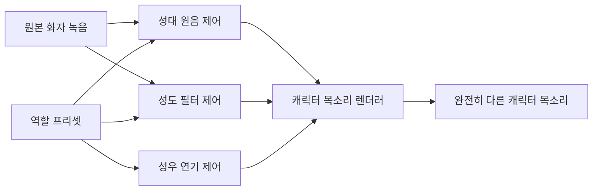

# 성도 기반 목소리 설계 엔진

[English document](VOCAL_TRACT_ENGINE.md)

KVAE는 이제 캐릭터 목소리를 단순 pitch 변환으로만 보지 않습니다. `vocal-tract` 계층은 목소리를 성대 원음, 성도 필터, 조음, 연기 운용으로 나눠 설계합니다.



## 명령

```powershell
$env:PYTHONPATH = "src"
python -m kva_engine vocal-tract --role monster_deep_clear --compact
```

출력에는 아래 항목이 들어갑니다.

- 성대 원음 제어: pitch ratio, tension, breath noise, roughness, subharmonics
- 성도 제어: 성도 길이, 포먼트 이동, bandwidth, 인두 폭, 입술 둥글림, 비강 공명
- 조음 제어: 턱 열림, 혀 높이, 자음 명료도, 모음 안정성
- 연기 제어: 원본 정체성 유지 강도, 캐릭터 거리, 속도, 쉼
- ffmpeg 호환 v1 filter chain

## 이론

기본 철학은 source-filter theory입니다. 목소리는 성대에서 만들어지는 원음과, 입과 목의 공명 구조가 만드는 필터로 나눠 볼 수 있습니다. Praat도 source와 filter를 분리해 조작한 뒤 합성하는 방식을 설명하고, WORLD vocoder는 F0, spectral envelope, aperiodicity를 분석하고 다시 합성하는 실용적 경로를 제공합니다.

KVAE v1은 완전한 해부학 시뮬레이터가 아닙니다. 대신 그 시뮬레이터가 따라야 할 제어 계약입니다. 지금은 deterministic filter를 구동하고, 이후 WORLD, RVC/FreeVC, KVAE neural speech-to-speech backend가 같은 계약을 이어받게 됩니다.

제품 목표는 성우형 음성 변환입니다. 하나의 인간 녹음 연기가 여러 캐릭터 정체성으로 바뀌되, 타이밍, 의도, 한국어 호흡은 보존되어야 합니다. [전문 성우 프로그램 벤치마킹 구현](PRO_VOICE_BENCHMARK_IMPLEMENTATION.ko.md)은 이 목표를 KVAE가 받아들인 제품 교훈과 연결합니다.

## 캐릭터 예시

- `child_bright`: 짧은 성도, 높은 포먼트, 밝은 고역
- `wolf_growl_clear`: 긴 성도, 낮은 포먼트, 약간의 비강/거친 원음, 명료도 유지
- `monster_deep_clear`: 큰 성도, 무거운 인두 공명, 낮은 spectral tilt
- `dinosaur_giant_roar`: 극단적으로 긴 성도, 매우 낮은 포먼트, 거칠고 subharmonic이 섞인 원음

## 공룡 레이어 V2

`dinosaur_giant`와 `dinosaur_giant_roar`는 이제 단일 저음 필터가 아니라 레이어 방식의 v2 체인을 사용합니다.

- 메인 변환 연기
- 낮은 흉강 공명 레이어
- 거친 목/그릿 레이어
- 지연된 저주파 몸통 울림 레이어

낮은 레이어들은 원본 연기 길이를 보존하도록 보정됩니다. 그래서 단순히 느려진 사람 목소리보다, 보스의 연기 위에 큰 생물의 몸통과 울림이 얹힌 결과를 목표로 합니다.

## 연구 기준점

- Praat source-filter synthesis: https://praat.org/manual/Source-filter_synthesis.html
- WORLD vocoder: https://github.com/mmorise/World
- AutoVC zero-shot voice style transfer: https://proceedings.mlr.press/v97/qian19c/qian19c.pdf
- YourTTS zero-shot multi-speaker TTS and voice conversion: https://arxiv.org/abs/2112.02418

## 안전 원칙

원본 정체성 유지 강도가 낮으면 결과물은 원본 화자처럼 들리지 않을 수 있습니다. KVAE는 이 경우 design warning을 남깁니다. private 음성은 로컬에만 두고, 공개 결과물에는 AI 음성 사용 사실을 고지해야 합니다.
