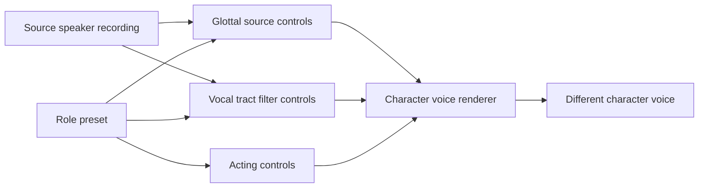

# Vocal Tract Voice Design

[Korean document](VOCAL_TRACT_ENGINE.ko.md)

KVAE now treats a character voice as more than pitch shifting. The `vocal-tract` layer creates a source-filter voice design: a glottal source, a vocal-tract filter, articulation controls, and acting controls.



## Command

```powershell
$env:PYTHONPATH = "src"
python -m kva_engine vocal-tract --role monster_deep_clear --compact
```

The output contains:

- glottal-source controls: pitch ratio, tension, breath noise, roughness, subharmonics
- vocal-tract controls: tract length, formant shift, bandwidth, pharynx width, lip rounding, nasal resonance
- articulation controls: jaw opening, tongue height, consonant precision, vowel stability
- performance controls: identity anchor, character distance, tempo, pause scale
- an ffmpeg-compatible v1 filter chain

## Theory

The design follows source-filter theory: speech can be modeled as a source signal filtered by vocal-tract resonances. Praat describes the same split as changing the source and the filter before synthesis, and WORLD exposes a practical vocoder path through F0, spectral envelope, and aperiodicity.

KVAE v1 is not a full anatomical simulator. It is the control contract for one. Today it drives deterministic filters; later it can drive WORLD, RVC/FreeVC, or a KVAE neural speech-to-speech backend.

## Character Examples

- `child_bright`: shorter vocal tract, higher formants, brighter high-frequency energy
- `wolf_growl_clear`: longer tract, lower formants, nasal/rough source, still intelligible
- `monster_deep_clear`: larger tract, heavier pharyngeal resonance, lower spectral tilt
- `dinosaur_giant_roar`: extreme tract length, low formants, rough and subharmonic source

## Research Anchors

- Praat source-filter synthesis: https://praat.org/manual/Source-filter_synthesis.html
- WORLD vocoder: https://github.com/mmorise/World
- AutoVC zero-shot voice style transfer: https://proceedings.mlr.press/v97/qian19c/qian19c.pdf
- YourTTS zero-shot multi-speaker TTS and voice conversion: https://arxiv.org/abs/2112.02418

## Safety

A low identity anchor means the result may no longer sound like the source speaker. KVAE marks that explicitly in the design warnings. Private voices remain local, and generated character voices should still disclose AI voice use when published.
